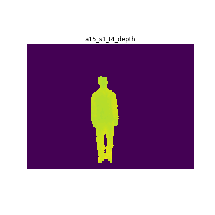

# Multi-modal Human Actions
In this repo, we would analyze the open source human action regonition data from UT Dallas (data provided [here](https://www.utdallas.edu/~kehtar/UTD-MHAD.html))

TODO: add more stuffs

## Depth Data
The depth data is a `(240, 320, 55) WidthxHeightxFrames matrix`.  
Each frame contains an image  
Example of the depth data looks like this  

## Skeleton Data
Each skeleton data is a `20 x 3 x num_frame matrix`.  
Each row of a skeleton frame corresponds to three spatial coordinates of a joint.  
The skeleton joint order in UTD-MAD dataset:
1. head; 
2. shoulder_center;
3. spine;
4. hip_center;
5. left_shoulder;
6. left_elbow;
7. left_wrist;
8. left_hand;
9. right_shoulder;
10. right_elbow;
11. right_wrist;
12. right_hand;
13. left_hip;
14. left_knee;
15. left_ankle;
16. left_foot;
17. right_hip;
18. right_knee;
19. right_ankle;
20. right_foot;
